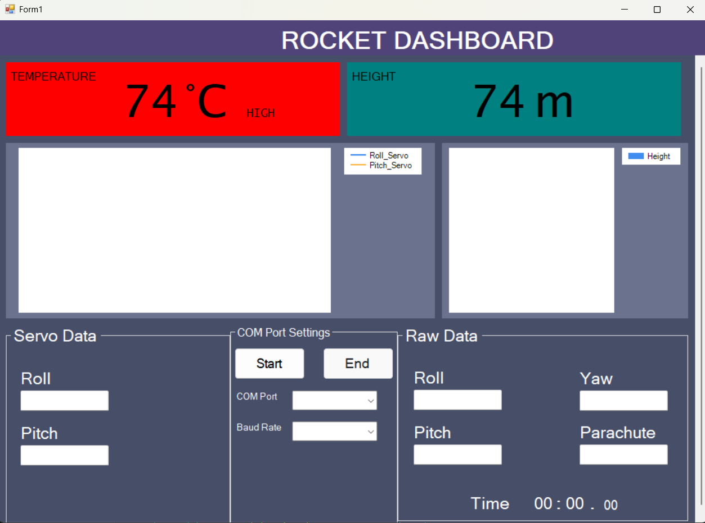

# Rocket Dashboard - Ground Control Station (GCS)

A high-performance Windows-based Ground Control Station (GCS) built with C# and .NET, designed for real-time telemetry monitoring and data visualization for rocket flight missions.

## Overview
This application serves as the primary interface for monitoring rocket health and flight dynamics. It processes incoming telemetry data via Serial Communication and provides a visual dashboard for mission critical decision-making.

## Key Features
* **Real-time Telemetry:** Instant monitoring of **Temperature** (with high-heat visual alerts) and **Altitude** (Height).
* **Attitude Monitoring:** Tracks orientation data including **Roll, Pitch, and Yaw**.
* **Dynamic Data Visualization:** Real-time charting for **Servo movement** and **Altitude trends** using high-performance graphics libraries.
* **Mission Control:** * Configurable **COM Port** and **Baud Rate** settings.
    * Flight Mission Timer for precise event tracking.
    * Recovery system monitoring (Parachute deployment status).
* **Raw Data Feed:** Terminal-style view for monitoring incoming raw data strings, essential for debugging sensor calibration.

## Tech Stack
* **Language:** C#
* **Framework:** .NET Framework (Windows Forms)
* **Graphics:** SharpGL & OpenTK (Optimized for low-latency rendering)
* **Communication:** RS-232 Serial Protocol

## Installation & Usage
1.  Go to the **[Releases](https://github.com/Kresnananta/Rocket-Dashboard/releases)** page and download the latest `.zip` file.
2.  Connect your telemetry hardware (e.g., Arduino/ESP32 via LoRa or USB).
3.  Launch `WindowsFormsApp1.exe`.
4.  Select the correct **COM Port** and **Baud Rate** from the settings panel.
5.  Click **Start** to begin receiving data.

## Dashboard Preview

---
Developed by [Agung Kresna/Kresnananta] - PNBIT Competition 2023.